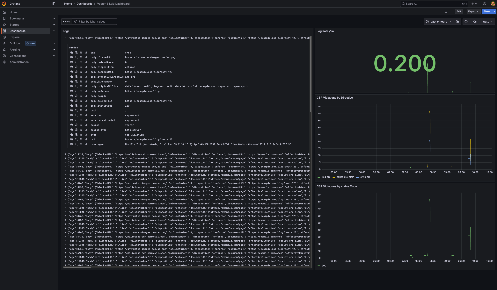

# CSP Reports - Vector, Loki & Grafana Stack

Endpoint for Content Security Policy (CSP) reports using Vector, Loki, and Grafana.



## Services

- **Vector**: Data collection and processing pipeline
- **Loki**: Log aggregation system
- **Grafana**: Visualization and monitoring dashboards

## Quick Start

1. Start the stack:
   ```bash
   docker-compose up -d
   ```

2. Access the services:
   - **Grafana**: http://localhost:3000 (admin/admin)
   - **Vector API**: http://localhost:8686
   - **Loki**: http://localhost:3100

## Configuration

### CSP Header
- https://developer.mozilla.org/en-US/docs/Web/HTTP/Reference/Headers/Reporting-Endpoints 
- https://developer.mozilla.org/en-US/docs/Web/HTTP/Reference/Headers/Content-Security-Policy/report-to  
- https://developer.mozilla.org/en-US/docs/Web/HTTP/Reference/Headers/Content-Security-Policy/report-uri (Deprecated)
- https://developer.mozilla.org/en-US/docs/Web/HTTP/Reference/Headers/Content-Security-Policy-Report-Only


```
Reporting-Endpoints: csp-endpoint="https://example.com/csp-reports"
Content-Security-Policy: default-src 'self'; report-to csp-endpoint
```

### Vector
- Configuration: `vector/vector.yaml`
- Data directory: `vector/data`
- Ports:
  - 8686: Vector API and web UI
  - 8080: Reports endpoint

### Loki
- Configuration: `loki/loki-config.yml`
- Data stored in Docker volume: `loki-data`
- Port: 3100

### Grafana
- Provisioning: `grafana/provisioning/`
- Dashboards: `grafana/dashboards/`
- Data stored in Docker volume: `grafana-data`
- Port: 3000

## Usage

The stack is configured to:
1. Vector collects CSP Reports in JSON format
2. Vector forwards reports to Loki
3. Grafana displays reports from Loki with pre-configured dashboards

## Stopping the Stack

```bash
docker-compose down
```

To remove volumes as well:
```bash
docker-compose down -v
```
